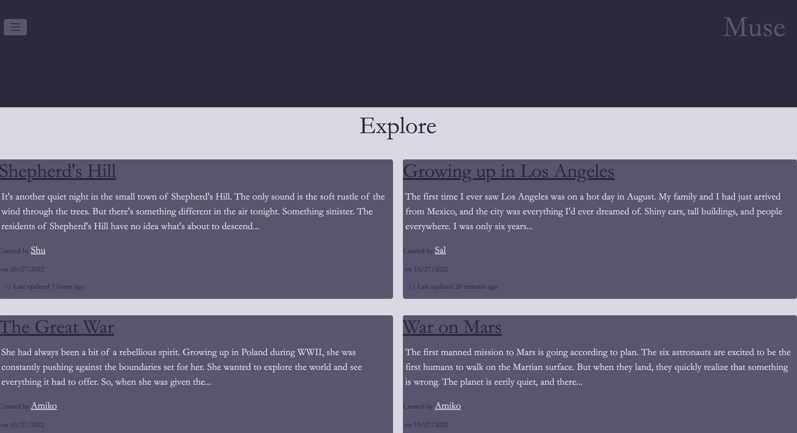

# Muse

# Motivation
The motivation for this project was to use an AI API to help users get the ball rolling on creative writing.  The user inputs a sentence or two of what they want to write about and the AI API returns with your opening paragraph.

# Build Status
The current build is finished with plans on adding the following feature: Image generation for your writing.

# Screenshots
  
  
  
  
  

# Technology Used

* Express.js
* Node
* npm
* Bootstrap
* Heroku
* mysql2
* Quill
* Sequelize
* OpenAI API
* Express-Handlebars
* Express-Session
* bcrypt
* dotenv

# Features
The site allows you to generate creative writing content with a sentence you provide.  Once you have signed up it also allows you to save projects and share with others.  You can see public projects as well as make your own projects private.

# Installation
[Visit Site](https://muse-assist.herokuapp.com/)

# API Reference
[AI Website](https://openai.com/api/)

# How To Use
[Link to site. Click me!](https://muse-assist.herokuapp.com/)  
Make sure you  highlight   the prompt (your input) of what you want to be used to generate content with AI.

# Credits
Shu Zhu  
Allan Ramirez  
Nathan Ramierez  
Ilya Feldman

# License
ISC License

Copyright (c) 2022

Permission is hereby granted, free of charge, to any person obtaining a copy 
of this software and associated documentation files (the "Software"), to deal
in the Software without restriction, including without limitation the rights
to use, copy, modify, merge, publish, distribute, sublicense, and/or sell
copies of the Software, and to permit persons to whom the Software is
furnished to do so, subject to the following conditions:

The above copyright notice and this permission notice shall be included in all
copies or substantial portions of the Software.

THE SOFTWARE IS PROVIDED "AS IS", WITHOUT WARRANTY OF ANY KIND, EXPRESS OR
IMPLIED, INCLUDING BUT NOT LIMITED TO THE WARRANTIES OF MERCHANTABILITY,
FITNESS FOR A PARTICULAR PURPOSE AND NONINFRINGEMENT. IN NO EVENT SHALL THE
AUTHORS OR COPYRIGHT HOLDERS BE LIABLE FOR ANY CLAIM, DAMAGES OR OTHER
LIABILITY, WHETHER IN AN ACTION OF CONTRACT, TORT OR OTHERWISE, ARISING FROM,
OUT OF OR IN CONNECTION WITH THE SOFTWARE OR THE USE OR OTHER DEALINGS IN THE
SOFTWARE.